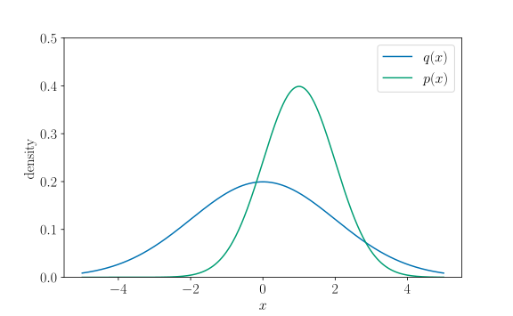
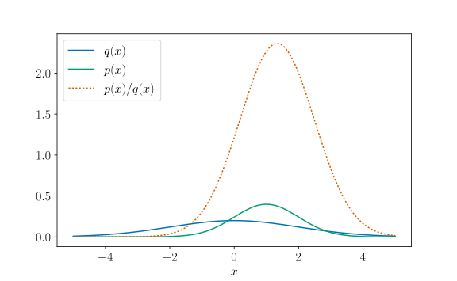
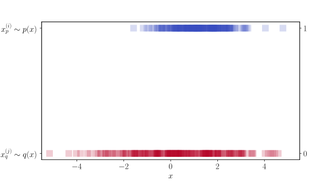
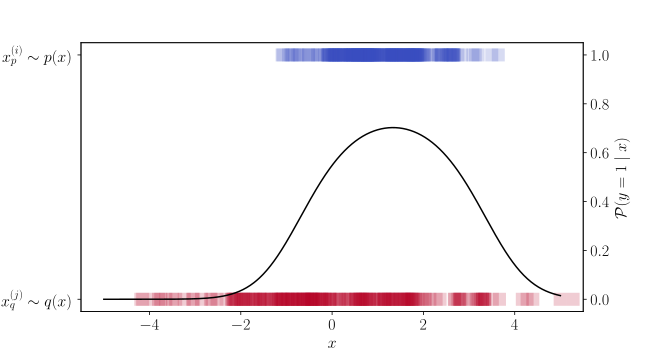
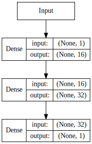
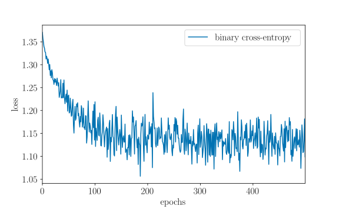
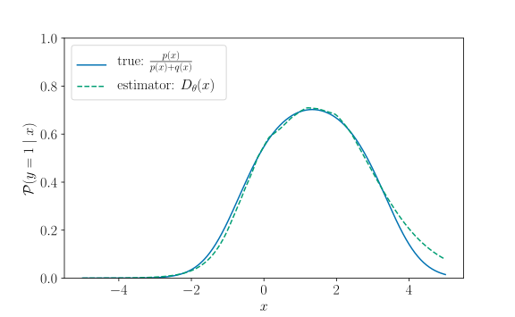
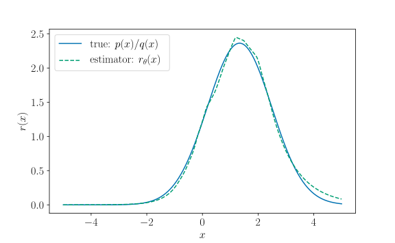
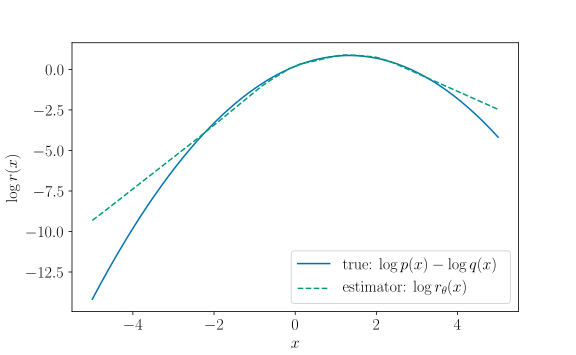
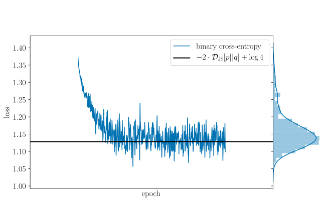

<!-- TODO: Clarify that optimal classifier refers to the classifier that minimizes the Bayes risk -->

The Kullback-Leibler (KL) divergence between distributions $p$ and $q$ is 
defined as

$$
\mathcal{D}\_{\mathrm{KL}}[p(x) || q(x)] := 
\mathbb{E}\_{p(x)} \left [ \log \left ( \frac{p(x)}{q(x)} \right ) \right ].
$$

It can be expressed more succinctly as

$$
\mathcal{D}\_{\mathrm{KL}}[p(x) || q(x)] = \mathbb{E}\_{p(x)} [ \log r^{\*}(x) ],
$$

where $r^{\*}(x)$ is defined to be the ratio of between the densities $p(x)$ and 
$q(x)$,

$$ 
r^{\*}(x) := \frac{p(x)}{q(x)}.
$$

This density ratio is crucial for computing not only the KL divergence but for
all $f$-divergences, defined as[^1]

$$
\mathcal{D}\_f[p(x) || q(x)] := 
\mathbb{E}\_{q(x)} \left [ f \left ( \frac{p(x)}{q(x)} \right ) \right ].
$$

Rarely can this expectation (i.e. integral) can be calculated analytically---in 
most cases, we must resort to Monte Carlo approximation methods, which 
explicitly requires the density ratio.
In the more severe case where this density ratio is unavailable, because either 
or both $p(x)$ and $q(x)$ are not calculable, we must resort to methods for 
*density ratio estimation*. 
In this post, we illustrate how to perform density ratio estimation by 
exploiting its tight correspondence to *probabilistic classification*.


### Example: Univariate Gaussians

Let us consider the following univariate Gaussian distributions as the running 
example for this post,   

$$
p(x) = \mathcal{N}(x \mid 1, 1^2), 
\qquad
\text{and}
\qquad
q(x) = \mathcal{N}(x \mid 0, 2^2).
$$

We will be using *TensorFlow*, *TensorFlow Probability*, and *Keras* in the 
code snippets throughout this post.

```python
import tensorflow as tf
import tensorflow_probability as tfp
```

We first instantiate the distributions:

```python
p = tfp.distributions.Normal(loc=1., scale=1.)
q = tfp.distributions.Normal(loc=0., scale=2.)
```

Their densities are shown below:



For any pair of distributions, we can implement their density ratio function $r$ 
as follows: 

```python
def log_density_ratio(p, q):

    def log_ratio(x):

        return p.log_prob(x) - q.log_prob(x)

    return log_ratio
```

```python
def density_ratio(p, q):

    log_ratio = log_density_ratio(p, q)

    def ratio(x):

        return tf.exp(log_ratio(x))

    return ratio
```

Let's create the density ratio function for the Gaussian distributions we just 
instantiated:

```python
>>> r = density_ratio(p, q)
```

This density ratio function is plotted as the orange dotted line below, 
alongside the individual densities shown in the previous plot:



## Analytical Form

For our running example, we picked $p(x)$ and $q(x)$ to be Gaussians so that 
it is possible to integrate out $x$ and compute the KL divergence *analytically*.
When we introduce the approximate methods later, this will provide us a "gold 
standard" to benchmark against.

In general, for Gaussian distributions

$$
p(x) = \mathcal{N}(x \mid \mu\_p, \sigma\_p^2), 
\qquad
\text{and}
\qquad
q(x) = \mathcal{N}(x \mid \mu\_q, \sigma\_q^2),
$$
it is easy to verify that
$$
\mathrm{KL}[ p(x) || q(x) ]
= \log \sigma\_q - \log \sigma\_p - \frac{1}{2} 
  \left [ 
    1 - \left ( \frac{\sigma\_p^2 + (\mu\_p - \mu\_q)^2}{\sigma\_q^2} \right ) 
  \right ].
$$

This is implemented below:

```python
def _kl_divergence_gaussians(p, q):

    r = p.loc - q.loc

    return (tf.log(q.scale) - tf.log(p.scale) -
            .5 * (1. - (p.scale**2 + r**2) / q.scale**2))
```
We can use this to compute the KL divergence between $p(x)$ and $q(x)$ 
*exactly*:
```python
>>> _kl_divergence_gaussians(p, q).eval()
0.44314718
```

Equivalently, we could also use `kl_divergence` from *TensorFlow 
Probability--Distributions* (`tfp.distributions`), which implements the 
analytical closed-form expression of the KL divergence between distributions 
when such exists.

```python
>>> tfp.distributions.kl_divergence(p, q).eval()
0.44314718
```

## Monte Carlo Estimation --- prescribed distributions

For distributions where their KL divergence is not analytically tractable, we 
may appeal to Monte Carlo (MC) estimation:

$$
\begin{align\*}
  \mathcal{D}\_{\mathrm{KL}}[p(x) || q(x)] 
  & = \mathbb{E}\_{p(x)} [ \log r^{\*}(x) ] \newline
  & \approx \frac{1}{M} \sum\_{i=1}^{M} \log r^{\*}(x_p^{(i)}),
  \quad x_p^{(i)} \sim p(x).
\end{align\*}
$$

Clearly, this requires the density ratio $r^{\*}(x)$ and, in turn, the densities 
$p(x)$ and $q(x)$ to be analytically tractable. Distributions for which the 
density function can be readily evaluated are sometimes referred to as 
**prescribed distributions**. As before, we *prescribed* Gaussians distributions 
in our running example so the Monte Carlo estimate can be later compared against.
We approximate their KL divergence using $M = 5000$ Monte Carlo samples as 
follows:

```python
>>> p_samples = p.sample(5000)
>>> true_log_ratio = log_density_ratio(p, q)
>>> tf.reduce_mean(true_log_ratio(p_samples)).eval()
0.44670376
```

Or equivalently, using the `expectation` function from *TensorFlow 
Probability--Monte Carlo* (`tfp.monte_carlo`):

```python
>>> tfp.monte_carlo.expectation(f=true_log_ratio, samples=p_samples).eval()
0.4581419
```

More generally, we can approximate any $f$-divergence with MC estimation: 

$$
\begin{align\*}
  \mathcal{D}\_f[p(x) || q(x)] 
  & = \mathbb{E}\_{q(x)} [ f(r^{\*}(x)) ] \newline
  & \approx \frac{1}{M} \sum\_{i=1}^{M} f(r^{\*}(x_q^{(i)})),
  \quad x_q^{(i)} \sim q(x).
\end{align\*}
$$

This can be done using the  `monte_carlo_csiszar_f_divergence` function from 
*TensorFlow Probability--Variational Inference* (`tfp.vi`). 
One simply needs to specify the appropriate convex function $f$.
The convex function that instantiates the (forward) KL divergence is provided
in `tfp.vi` as `kl_forward`, alongside many other common $f$-divergences.

```python
>>> tfp.vi.monte_carlo_csiszar_f_divergence(f=tfp.vi.kl_forward,
...                                         p_log_prob=p.log_prob, q=q,
...                                         num_draws=5000).eval()
0.4430853
```

## Density Ratio Estimation --- implicit distributions

When either density $p(x)$ or $q(x)$ is unavailable, things become more tricky. 
Which brings us to the topic of this post. Suppose we only have samples from 
$p(x)$ and $q(x)$---these could be natural images, outputs from a neural 
network with stochastic inputs, or in the case of our running example, i.i.d. 
samples drawn from Gaussians, etc. 
Distributions for which we are only able to observe their samples are known as
**implicit distributions**, since their samples *imply* some underlying true 
density which we may not have direct access to.

Density ratio estimation is concerned with estimating the ratio of densities
$r^{\*}(x) = p(x) / q(x)$ given access only to samples from $p(x)$ and $q(x)$.
Moreover, density ratio estimation usually encompass methods that achieve this 
without resorting to direct *density estimation* of the individual densities 
$p(x)$ or $q(x)$, since any error in the estimation of the denominator $q(x)$ 
is magnified exponentially. 

Of the many density ratio estimation methods that now 
flourish[^sugiyama2012density], the classical approach of *probabilistic 
classification* remains dominant, due in no small part to its simplicity.

### Reducing Density Ratio Estimation to Probabilistic Classification

We now demonstrate that density ratio estimation can be reduced to probabilistic 
classification. We shall do this by highlighting the one-to-one correspondence 
between the density ratio of $p(x)$ and $q(x)$ and the optimal probabilistic 
classifier that discriminates between their samples. 
Specifically, suppose we have a collection of samples from both $p(x)$ and $q(x)$, 
where each sample is assigned a class label indicating which distribution it was 
drawn from. Then, from an estimator of the class-membership probabilities, it is
straightforward to recover an estimator of the density ratio.

Suppose we have $N\_p$ and $N\_q$ samples drawn from $p(x)$ and $q(x)$, 
respectively,

$$
x\_p^{(1)}, \dotsc, x\_p^{(N\_p)} \sim p(x), 
\qquad \text{and} \qquad 
x\_q^{(1)}, \dotsc, x\_q^{(N\_q)} \sim q(x).
$$

Then, we form the dataset $\{ (x\_n, y\_n) \}\_{n=1}^N$, where $N = N\_p + N\_q$
and

$$
\begin{align\*}
  (x\_1, \dotsc, x\_N) & = (x\_p^{(1)}, \dotsc, x\_p^{(N\_p)},
                            x\_q^{(1)}, \dotsc, x\_q^{(N\_q)}), \newline
  (y\_1, \dotsc, y\_N) & = (\underbrace{1, \dotsc, 1}\_{N\_p}, 
                            \underbrace{0, \dotsc, 0}\_{N\_q}).
\end{align\*}
$$

In other words, we label samples drawn from $p(x)$ as 1 and those drawn from 
$q(x)$ as 0. In code, this looks like:

```python
>>> p_samples = p.sample(sample_shape=(n_p, 1))
>>> q_samples = q.sample(sample_shape=(n_q, 1))
>>> X = tf.concat([p_samples, q_samples], axis=0)
>>> y = tf.concat([tf.ones_like(p_samples), tf.zeros_like(q_samples)], axis=0)
```

This dataset is visualized below. The blue squares in the top row are samples 
$x_p^{(i)} \sim p(x)$ with label 1; red squares in the bottom row are samples
$x_q^{(j)} \sim q(x)$ with label 0.



Now, by construction, we have

$$
p(x) = \mathcal{P}(x \mid y = 1),
\qquad
\text{and}
\qquad
q(x) = \mathcal{P}(x \mid y = 0).
$$

Using Bayes' rule, we can write

$$
\mathcal{P}(x \mid y) = 
\frac{\mathcal{P}(y \mid x) \mathcal{P}(x)}
     {\mathcal{P}(y)}.
$$

Hence, we can express the density ratio $r^{\*}(x)$ as

$$
\begin{align\*}
  r^{\*}(x) & = \frac{p(x)}{q(x)}
       = \frac{\mathcal{P}(x \mid y = 1)}
              {\mathcal{P}(x \mid y = 0)} \newline
       & = \left ( \frac{\mathcal{P}(y = 1 \mid x) \mathcal{P}(x)}
                        {\mathcal{P}(y = 1)} \right ) 
           \left ( \frac{\mathcal{P}(y = 0 \mid x) \mathcal{P}(x)}
                        {\mathcal{P}(y = 0)} \right ) ^ {-1} \newline
       & = \frac{\mathcal{P}(y = 0)}{\mathcal{P}(y = 1)} 
           \frac{\mathcal{P}(y = 1 \mid x)}
                {\mathcal{P}(y = 0 \mid x)}.
\end{align\*}
$$

Let us approximate the ratio of marginal densities by the ratio of sample sizes,

$$
\frac{\mathcal{P}(y = 0)}
     {\mathcal{P}(y = 1)} 
\approx
\frac{N\_q}{N\_p + N\_q} 
\left ( \frac{N\_p}{N\_p + N\_q} \right )^{-1}
= \frac{N\_q}{N\_p}.
$$

To avoid notational clutter, let us assume from now on that $N\_q = N\_p$. 
We can then write $r^{\*}(x)$ in terms of class-posterior probabilities,

$$
\begin{align\*}
  r^{\*}(x) = \frac{\mathcal{P}(y = 1 \mid x)}
              {\mathcal{P}(y = 0 \mid x)}.
\end{align\*}
$$

#### Recovering the Density Ratio from the Class Probability

This yields a one-to-one correspondence between the density ratio $r^{\*}(x)$ 
and the class-posterior probability $\mathcal{P}(y = 1 \mid x)$. 
Namely,

$$
\begin{align\*}
  r^{\*}(x) = \frac{\mathcal{P}(y = 1 \mid x)}
              {\mathcal{P}(y = 0 \mid x)} 
       & = \frac{\mathcal{P}(y = 1 \mid x)}
                {1 - \mathcal{P}(y = 1 \mid x)} \newline
       & = \exp 
           \left [ 
             \log \frac{\mathcal{P}(y = 1 \mid x)}
                       {1 - \mathcal{P}(y = 1 \mid x)} \right ] \newline
       & = \exp[ \sigma^{-1}(\mathcal{P}(y = 1 \mid x)) ],
\end{align\*}
$$

where $\sigma^{-1}$ is the *logit* function, or inverse sigmoid function, given 
by $\sigma^{-1}(\rho) = \log \left ( \frac{\rho}{1-\rho} \right )$

#### Recovering the Class Probability from the Density Ratio

By simultaneously manipulating both sides of this equation, we can also recover 
the exact class-posterior probability as a function of the density ratio,


$$
\mathcal{P}(y=1 \mid x) = \sigma(\log r^{\*}(x)) = \frac{p(x)}{p(x) + q(x)}.
$$


This is implemented below:

```python
def optimal_classifier(p, q):

    def classifier(x):

        return tf.truediv(p.prob(x), p.prob(x) + q.prob(x))

    return classifier
```

In the figure below, The class-posterior probability $\mathcal{P}(y=1 \mid x)$ 
is plotted against the dataset visualized earlier.



### Probabilistic Classification with Logistic Regression

The class-posterior probability $\mathcal{P}(y = 1 \mid x)$ can be approximated
using a parameterized function $D\_{\theta}(x)$ with parameters $\theta$. This
functions takes as input samples from $p(x)$ and $q(x)$ and outputs a *score*,
or probability, in the range $[0, 1]$ that it was drawn from $p(x)$. 
Hence, we refer to $D\_{\theta}(x)$ as the probabilistic classifier.

From before, it is clear to see how an estimator of the density ratio 
$r\_{\theta}(x)$ might be constructed as a function of probabilistic classifier 
$D\_{\theta}(x)$. Namely,

$$
\begin{align\*}
  r\_{\theta}(x) & = \exp[ \sigma^{-1}(D\_{\theta}(x)) ] \newline
  & \approx \exp[ \sigma^{-1}(\mathcal{P}(y = 1 \mid x)) ] = r^{\*}(x),
\end{align\*}
$$
and *vice versa*,
$$
\begin{align\*}
  D\_{\theta}(x) & = \sigma(\log r_{\theta}(x)) \newline
  & \approx \sigma(\log r^{\*}(x)) = \mathcal{P}(y = 1 \mid x).
\end{align\*}
$$

Instead of $D\_{\theta}(x)$, we usually specify the parameterized function 
$\log r\_{\theta}(x)$. This is also referred to as the *log-odds*, or *logits*, 
since it is equivalent to the unnormalized output of the classifier before being 
fed through the logistic sigmoid function.

We define a small fully-connected neural network with two hidden layers and ReLU
activations:

```python
log_ratio = Sequential([
    Dense(16, input_dim=1, activation='relu'),
    Dense(32, activation='relu'),
    Dense(1),
])
```

This simple architecture is visualized in the diagram below:



We learn the optimal class probability estimator by optimizing it with respect
to a *proper scoring rule*[^gneiting2007strictly] that yields well-calibrated probabilistic predictions, such as the *binary cross-entropy loss*,

$$
\begin{align\*}
  \mathcal{L}(\theta) & := 
  \- \mathbb{E}\_{p(x)} [ \log D\_{\theta} (x) ] 
  \- \mathbb{E}\_{q(x)} [ \log(1-D\_{\theta} (x)) ] \newline
  & =
  \- \mathbb{E}\_{p(x)} [ \log \sigma ( \log r\_{\theta} (x) ) ] 
  \- \mathbb{E}\_{q(x)} [ \log(1 - \sigma ( \log r\_{\theta} (x) )) ].
\end{align\*}
$$

An implementation optimized for numerical stability is given below:

```python
def _binary_crossentropy(log_ratio_p, log_ratio_q):

    loss_p = tf.nn.sigmoid_cross_entropy_with_logits(
        logits=log_ratio_p,
        labels=tf.ones_like(log_ratio_p)
    )

    loss_q = tf.nn.sigmoid_cross_entropy_with_logits(
        logits=log_ratio_q,
        labels=tf.zeros_like(log_ratio_q)
    )

    return tf.reduce_mean(loss_p + loss_q)
```

Now we can build a [multi-input/multi-output model](https://keras.io/getting-started/functional-api-guide/#multi-input-and-multi-output-models), where the [inputs 
are fixed with stochastic tensors](http://louistiao.me/notes/keras-constant-input-layers-with-fixed-source-of-stochasticity/)---samples from 
$p(x)$ and $q(x)$, respectively.

```python
>>> x_p = Input(tensor=p_samples)
>>> x_q = Input(tensor=q_samples)
>>> log_ratio_p = log_ratio(x_p)
>>> log_ratio_q = log_ratio(x_q)
```

The model can now be compiled and finalized. Since we're using a custom loss 
that take the two sets of log-ratios as input, we specify `loss=None` and 
define it instead through the `add_loss` method.

```python
>>> m = Model(inputs=[x_p, x_q], outputs=[log_ratio_p, log_ratio_q])
>>> m.add_loss(_binary_crossentropy(log_ratio_p, log_ratio_q))
>>> m.compile(optimizer='rmsprop', loss=None)
```

As a sanity-check, the loss evaluated on a random batch can be obtained like so: 

```python
>>> m.evaluate(x=None, steps=1)
1.3765026330947876
```

We can now fit our estimator, recording the loss at the end of each epoch:

```python
>>> hist = m.fit(x=None, y=None, steps_per_epoch=1, epochs=500)
```

The following animation shows how the predictions for the probabilistic 
classifier, density ratio, log density ratio, evolve after every epoch:

<video controls autoplay src="https://giant.gfycat.com/FrighteningThunderousFlicker.webm"></video>

It is overlaid on top of their exact, analytical counterparts, which are only 
available since we prescribed them to be Gaussian distribution. 
For implicit distributions, these won't be accessible at all.

Below is the final plot of how the binary cross-entropy loss converges:



Below is a plot of the probabilistic classifier $D\_{\theta}(x)$ (*dotted green*), 
plotted against the optimal classifier, which is the class-posterior probability 
$\mathcal{P}(y=1 \mid x) = \frac{p(x)}{p(x) + q(x)}$ (*solid blue*):



Below is a plot of the density ratio estimator $r\_{\theta}(x)$ 
(*dotted green*), plotted against the exact density ratio function 
$r^{\*}(x) = \frac{p(x)}{q(x)}$ (*solid blue*):



And finally, the previous plot in logarithmic scale:



While it may appear that we are simply performing regression on the latent 
function $r^{\*}(x)$ (which is not wrong---we are), it is important to emphasize that 
we do this without ever having observed values of $r^{\*}(x)$.
Instead, we only ever observed samples from $p(x)$ and $q(x)$ 
This has profound implications and potential for a great number of applications 
that we shall explore later on.

### Back to Monte Carlo estimation

Having an obtained an estimate of the log density ratio, it is now feasible to
perform Monte Carlo estimation:

$$
\begin{align\*}
  \mathcal{D}\_{\mathrm{KL}}[p(x) || q(x)] 
  & = \mathbb{E}\_{p(x)} [ \log r^{\*}(x) ] \newline
  & \approx \frac{1}{M} \sum\_{i=1}^{M} \log r^{\*}(x_p^{(i)}),
  \quad x_p^{(i)} \sim p(x) \newline
  & \approx \frac{1}{M} \sum\_{i=1}^{M} \log r\_{\theta}(x_p^{(i)}),
  \quad x_p^{(i)} \sim p(x).
\end{align\*}
$$

```python
>>> tf.squeeze(tfp.monte_carlo.expectation(f=log_ratio, samples=p_samples)).eval()
0.4570999
```

In other words, we draw MC samples from $p(x)$ as before. But instead of taking 
the mean of the function $\log r^{\*}(x)$ evaluated on these samples (which is 
unavailable for implicit distributions), we do so on a proxy function 
$\log r\_{\theta}(x)$ that is estimated through probabilistic classification as
described above.

## Learning in Implicit Generative Models

Now let's take a look at where these ideas are being used in practice.
Consider a collection of natural images, such as the MNIST handwritten 
digits shown below, which are assumed to be samples drawn from some implicit 
distribution $q(\mathbf{x})$:



Directly estimating the density of $q(\mathbf{x})$ may not always be feasible---in 
some cases, it may not even exist.
Instead, consider defining a parametric function $G\_{\phi}: \mathbf{z} \mapsto 
\mathbf{x}$ with parameters $\phi$, that takes as input $\mathbf{z}$ drawn from 
some fixed distribution $p(\mathbf{z})$. 
The outputs $\mathbf{x}$ of this generative process are assumed to be samples 
following some implicit distribution $p\_{\phi}(\mathbf{x})$. In other words,
we can write

$$
\mathbf{x} \sim p\_{\phi}(\mathbf{x}) \quad 
\Leftrightarrow \quad 
\mathbf{x} = G\_{\phi}(\mathbf{z}), 
\quad \mathbf{z} \sim p(\mathbf{z}).
$$

By optimizing parameters $\phi$, we can make $p\_{\phi}(\mathbf{x})$ close to 
the real data distribution $q(\mathbf{x})$. This is a compelling alternative to
density estimation since there are many situations where being able to generate 
samples is more important than being able to calculate the numerical value of 
the density. Some examples of these include *image super-resolution* and 
*semantic segmentation*.

One approach might be to introduce a classifier $D\_{\theta}$ that discriminates 
between real and synthetic samples. 
Then we optimize $G\_{\phi}$ to synthesize samples that are indistinguishable, 
to classifier $D\_{\theta}$, from the real samples. This can be achieved by 
simultaneously optimizing the binary cross-entropy loss, resulting in the 
saddle-point objective,

$$
\begin{align\*}
  & \min\_{\phi} \max\_{\theta}
  \mathbb{E}\_{q(\mathbf{x})} [ \log D\_{\theta} (\mathbf{x}) ] +
  \mathbb{E}\_{p\_{\phi}(\mathbf{x})} [ \log(1-D\_{\theta} (\mathbf{x})) ] \newline = 
  & \min\_{\phi} \max\_{\theta} 
  \mathbb{E}\_{q(\mathbf{x})} [ \log D\_{\theta} (\mathbf{x}) ] +
  \mathbb{E}\_{p(\mathbf{z})} [ \log(1-D\_{\theta} (G\_{\phi}(\mathbf{z}))) ].
\end{align\*}
$$

This is, of course, none other than the groundbreaking *generative adversarial 
network (GAN)*[^goodfellow2014generative]. 
You can read more about the density ratio estimation perspective of GANs in 
the paper by Uehara et al. 2016[^uehara2016generative]. For an even more general and complete treatment of learning in implicit models, I recommend the paper 
from Mohamed and Lakshminarayanan, 2016[^mohamed2016learning], which partially inspired this post.

For the remainder of this section, I want to highlight a variant of this 
approach that specifically aims to minimize the KL divergence w.r.t. parameters
$\phi$,

$$
\min\_{\phi} \mathcal{D}\_{\mathrm{KL}}[p\_{\phi}(\mathbf{x}) || q(\mathbf{x})].
$$

To overcome the fact that the densities of both $p\_{\phi}(\mathbf{x})$ and 
$q(\mathbf{x})$ are unknown, we can readily adopt the density ratio estimation 
approach outlined in this post. 
Namely, by maximizing the following objective,

$$
\begin{align\*}
  & \max\_{\theta}
  \mathbb{E}\_{q(\mathbf{x})} [ \log D\_{\theta} (\mathbf{x}) ] +
  \mathbb{E}\_{p(\mathbf{z})} [ \log(1-D\_{\theta} (G\_{\phi}(\mathbf{z}))) ] \newline
  = & \max\_{\theta}
  \mathbb{E}\_{q(\mathbf{x})} [ \log \sigma ( \log r\_{\theta} (\mathbf{x}) ) ] +
  \mathbb{E}\_{p(\mathbf{z})} [ \log(1 - \sigma ( \log r\_{\theta} (G\_{\phi}(\mathbf{z})) )) ],
\end{align\*}
$$

which attains its maximum at 

$$
r\_{\theta}(\mathbf{x}) = \frac{q(\mathbf{x})}{p\_{\phi}(\mathbf{x})}.
$$

Concurrently, we also minimize the current best estimate of the KL divergence,

$$
\begin{align\*}
\min\_{\phi} \mathcal{D}\_{\mathrm{KL}}[p\_{\phi}(\mathbf{x}) || q(\mathbf{x})] 
& = 
\min\_{\phi} \mathbb{E}\_{p\_{\phi}(\mathbf{x})} \left [ \log \frac{p\_{\phi}(\mathbf{x})}{q(\mathbf{x})} \right ] \newline
& \approx
\min\_{\phi} \mathbb{E}\_{p\_{\phi}(\mathbf{x})} [ - \log r\_{\theta}(\mathbf{x}) ] \newline
& = 
\min\_{\phi} \mathbb{E}\_{p(\mathbf{z})} [ - \log r\_{\theta}(G\_{\phi}(\mathbf{z})) ].
\end{align\*}
$$

In addition to being more stable than the vanilla GAN approach (alleviates 
saturating gradients), this is especially important in contexts where there is
a specific need to minimize the KL divergence, such as in *variational inference 
(VI)*.

This was first used in *AffGAN* by Sønderby et al. 2016[^sonderby2016amortised], 
and has since been incorporated in many papers that deal with implicit 
distributions in variational inference, such as 
(Mescheder et al. 2017[^mescheder2017adversarial], 
Huszar 2017[^huszar2017variational], 
Tran et al. 2017[^tran2017hierarchical], 
Pu et al. 2017[^pu2017adversarial], 
Chen et al. 2018[^chen2018symmetric], 
Tiao et al. 2018[^tiao2018cycle]), and many others.

## Bound on the Jensen-Shannon Divergence

Before we wrap things up, let us take another look at the plot of the 
binary-cross entropy loss recorded at the end of each epoch. 
We see that it converges quickly to some value. 
It is natural to wonder: what is the significance, if any, of this value?



It is in fact the (negative) Jensen-Shannon (JS) divergence, up to constants,

$$
\- 2 \cdot \mathcal{D}\_{\mathrm{JS}}[p(x) || q(x)] + \log 4.
$$

Recall the Jensen-Shannon divergence is defined as

$$
\mathcal{D}\_{\mathrm{JS}}[p(x) || q(x)]
= \frac{1}{2} \mathcal{D}\_{\mathrm{KL}}[p(x) || m(x)] + 
  \frac{1}{2} \mathcal{D}\_{\mathrm{KL}}[q(x) || m(x)],
$$

where $m$ is the mixture density

$$
m(x) = \frac{p(x) + q(x)}{2}.
$$

With our running example, this cannot be evaluated exactly since the KL 
divergence between a Gaussian and a mixture of Gaussians is analytically 
intractable.
However, like the KL, we can still estimate their JS divergence with Monte 
Carlo estimation[^2]: 

```python
>>> js = - tfp.vi.monte_carlo_csiszar_f_divergence(f=tfp.vi.jensen_shannon,
...                                                p_log_prob=p.log_prob,
...                                                q=q, num_draws=5000)
```

This value is shown in the horizontal black line in the plot above. Along the 
right margin, we also plot the a histogram of the binary cross-entropy loss 
values over epochs. We can see that this value indeed coincides with the mode of 
this histogram.

It is straightforward to show that we have the upper bound

$$
\inf\_{\theta} \mathcal{L}(\theta) \geq - 2 \cdot \mathcal{D}\_{\mathrm{JS}}[p(x) || q(x)] + \log 4.
$$

Firstly, we have 

$$
\begin{align\*}
  \sup\_{\theta} &
  \mathbb{E}\_{p(x)} [ \log D\_{\theta} (x) ] +
  \mathbb{E}\_{q(x)} [ \log(1-D\_{\theta} (x)) ] \newline 
  & =
  \mathbb{E}\_{p(x)} [ \log \mathcal{P}(y=1 \mid x) ] +
  \mathbb{E}\_{q(x)} [ \log \mathcal{P}(y=0 \mid x) ] \newline 
  & =
  \mathbb{E}\_{p(x)} \left [ \log \frac{p(x)}{p(x) + q(x)} \right ] +
  \mathbb{E}\_{q(x)} \left [ \log \frac{q(x)}{p(x) + q(x)} \right ] \newline 
  & =
  \mathbb{E}\_{p(x)} \left [ \log \frac{1}{2} \frac{p(x)}{m(x)} \right ] +
  \mathbb{E}\_{q(x)} \left [ \log \frac{1}{2} \frac{q(x)}{m(x)} \right ] \newline 
  & =
  \mathbb{E}\_{p(x)} \left [ \log \frac{p(x)}{m(x)} \right ] +
  \mathbb{E}\_{q(x)} \left [ \log \frac{q(x)}{m(x)} \right ] - 2 \log 2 \newline
  & = 2 \cdot \mathcal{D}\_{\mathrm{JS}}[p(x) || q(x)] - \log 4.
\end{align\*}
$$

Therefore,

$$
2 \cdot \mathcal{D}\_{\mathrm{JS}}[p(x) || q(x)] - \log 4 
\geq 
\sup\_{\theta} 
\mathbb{E}\_{p(x)} [ \log D\_{\theta} (x) ] +
\mathbb{E}\_{q(x)} [ \log(1-D\_{\theta} (x)) ].
$$

Negating both sides, we get

$$
\begin{align\*}
  \- 2 \cdot \mathcal{D}\_{\mathrm{JS}}[p(x) || q(x)] + \log 4
  \leq &
  \- \sup\_{\theta} 
  \mathbb{E}\_{p(x)} [ \log D\_{\theta} (x) ] + 
  \mathbb{E}\_{q(x)} [ \log(1-D\_{\theta} (x)) ] \newline
  = & \inf\_{\theta} 
  \- \mathbb{E}\_{p(x)} [ \log D\_{\theta} (x) ] 
  \- \mathbb{E}\_{q(x)} [ \log(1-D\_{\theta} (x)) ] \newline
  = & \inf\_{\theta} \mathcal{L}(\theta),
\end{align\*}
$$

as required.

In short, this tells us that the binary cross-entropy loss is *itself* an 
approximation (up to constants) to the Jensen-Shannon divergence. 
This begs the question: is it possible to construct a more general loss that bounds any given $f$-divergence?

## Teaser: Lower Bound on any $f$-divergence

Using convex analysis, one can actually show that for any $f$-divergence, we 
have the lower bound[^nguyen2010estimating]

$$
\mathcal{D}\_f[p(x) || q(x)]
\geq 
\sup\_{\theta} 
\mathbb{E}\_{p(x)} [ f'(r\_{\theta}(x)) ] -
\mathbb{E}\_{q(x)} [ f^{\star}(f'(r\_{\theta}(x))) ],
$$

with equality exactly when $r\_{\theta}(x) = r^{\*}(x)$. 
Importantly, this lower bound can be computed without requiring the densities of 
$p(x)$ or $q(x)$---only their samples are needed.

In the special case of $f(u) = u \log u - (u + 1) \log (u + 1)$, we recover the
binary cross-entropy loss and the previous result, as expected,

$$
\begin{align\*}
  \mathcal{D}\_f[p(x) || q(x)]
  & = 2 \cdot \mathcal{D}\_{\mathrm{JS}}[p(x) || q(x)] - \log 4 \newline
  & \geq \sup\_{\theta} 
  \mathbb{E}\_{p(x)} [ \log \sigma ( \log r\_{\theta} (x) ) ] +
  \mathbb{E}\_{q(x)} [ \log(1 - \sigma ( \log r\_{\theta} (x) )) ] \newline
  & = \sup\_{\theta} 
  \mathbb{E}\_{p(x)} [ \log D\_{\theta} (x) ] +
  \mathbb{E}\_{q(x)} [ \log(1-D\_{\theta} (x)) ].
\end{align\*}
$$

Alternately, in the special case of $f(u) = u \log u$, we get

$$
\begin{align\*}
  \mathcal{D}\_f[p(x) || q(x)]
  & = \mathcal{D}\_{\mathrm{KL}}[p(x) || q(x)] \newline
  & \geq \sup\_{\theta} 
  \mathbb{E}\_{p(x)} [ \log r\_{\theta} (x) ] -
  \mathbb{E}\_{q(x)} [ r\_{\theta} (x) - 1 ].
\end{align\*}
$$

This gives us *yet* another way to estimate the KL divergence between 
implicit distributions, in the form of a direct lower bound on the KL divergence 
itself. 
As it turns out, this lower bound is closely-related to the objective of the
*KL Importance Estimation Procedure (KLIEP)*[^sugiyama2008direct], and will be 
the topic of our next post in this series. 

# Summary

This post covered how to evaluate the KL divergence, or any $f$-divergence, 
between implicit distributions---distributions which we can only sample from. 
First, we underscored the crucial role of the density ratio in the estimation of 
$f$-divergences. 
Next, we showed the correspondence between the density ratio and the optimal 
classifier.
By exploiting this link, we demonstrated how one can use a trained probabilistic classifier to construct a proxy for the exact density ratio, and use this to 
enable estimation of any $f$-divergence.
Finally, we provided some context on where this method is used, touching upon 
some recent advances in implicit generative models and variational inference.

---

Cite as:

```
@article{tiao2018dre,
  title   = "{D}ensity {R}atio {E}stimation for {KL} {D}ivergence {M}inimization between {I}mplicit {D}istributions",
  author  = "Tiao, Louis C",
  journal = "tiao.io",
  year    = "2018",
  url     = "https://tiao.io/post/density-ratio-estimation-for-kl-divergence-minimization-between-implicit-distributions/"
}
```

To receive updates on more posts like this, follow me on [Twitter] and [GitHub]!

[Twitter]: https://twitter.com/louistiao
[GitHub]: https://github.com/ltiao

# Acknowledgements

I am grateful to [Daniel Steinberg](https://dsteinberg.github.io/) for providing 
extensive feedback and insightful discussions. I would also like to thank 
Alistair Reid and [Fabio Ramos](http://www-personal.usyd.edu.au/~framos/Home.html) 
for their comments and suggestions.

# Links and Resources

- The [notebook](https://gist.github.com/ltiao/c066d22588d9494cb4b94a6cdd472392) used to generate the figures in this post, which you can [try out in Colaboratory](https://colab.research.google.com/gist/ltiao/c066d22588d9494cb4b94a6cdd472392/approximating-the-kl-divergence-between-implicit-distributions.ipynb).
- The very readable textbook on [Density Ratio Estimation in Machine Learning](https://amzn.to/2EVZJMr)[^sugiyama2012density], which I highly recommend. (Note: the Gaussian distributions example was borrowed from this book.) <a target="_blank"  href="https://www.amazon.com/gp/product/0521190177/ref=as_li_tl?ie=UTF8&camp=1789&creative=9325&creativeASIN=0521190177&linkCode=as2&tag=tiao03-20&linkId=0907c42c1a834ffa68ca2f27c2bdb92f"></a>
- Shakir Mohamed's blog post [Machine Learning Trick of the Day: Density Ratio Trick](http://blog.shakirm.com/2018/01/machine-learning-trick-of-the-day-7-density-ratio-trick/).
- The paper by Menon and Ong, 2016[^menon2016linking], which gives a generalized treatment of the theoretical link between density ratio estimation and probabilistic classification.

[^gneiting2007strictly]: Gneiting, T., & Raftery, A. E. (2007). Strictly Proper Scoring Rules, Prediction, and Estimation. *Journal of the American Statistical Association*, 102(477), (pp. 359-378).
[^menon2016linking]: Menon, A., & Ong, C. S. (2016, June). Linking Losses for Density Ratio and Class-Probability Estimation. In *International Conference on Machine Learning* (pp. 304-313).
[^mohamed2016learning]: Mohamed, S., & Lakshminarayanan, B. (2016). Learning in Implicit Generative Models. *arXiv preprint arXiv:1610.03483*.
[^sugiyama2012density]: Sugiyama, M., Suzuki, T., & Kanamori, T. (2012). *Density Ratio Estimation in Machine Learning*. Cambridge University Press.
[^sugiyama2008direct]: Sugiyama, M., Nakajima, S., Kashima, H., Buenau, P. V., & Kawanabe, M. (2008). Direct importance estimation with model selection and its application to covariate shift adaptation. In Advances in neural information processing systems (pp. 1433-1440).
[^uehara2016generative]: Uehara, M., Sato, I., Suzuki, M., Nakayama, K., & Matsuo, Y. (2016). Generative Adversarial Nets from a Density Ratio Estimation Perspective. *arXiv preprint arXiv:1610.02920*.
[^friedman2001elements]: Friedman, J., Hastie, T., & Tibshirani, R. (2001). The elements of statistical learning (Vol. 1, No. 10). New York, NY, USA:: Springer series in statistics.
[^tiao2018cycle]: Tiao, L. C., Bonilla, E. V., & Ramos, F. (2018). Cycle-Consistent Adversarial Learning as Approximate Bayesian Inference. *arXiv preprint arXiv:1806.01771*.
[^mescheder2017adversarial]: Mescheder, L., Nowozin, S., & Geiger, A. (2017). Adversarial Variational Bayes: Unifying Variational Autoencoders and Generative Adversarial Networks. In *International Conference on Machine learning (ICML)*.
[^huszar2017variational]: Huszár, F. (2017). Variational inference using implicit distributions. *arXiv preprint arXiv:1702.08235*.
[^tran2017hierarchical]: Tran, D., Ranganath, R., & Blei, D. (2017). Hierarchical implicit models and likelihood-free variational inference. In *Advances in Neural Information Processing Systems* (pp. 5523-5533).
[^pu2017adversarial]: Pu, Y., Wang, W., Henao, R., Chen, L., Gan, Z., Li, C., & Carin, L. (2017). Adversarial symmetric variational autoencoder. In *Advances in Neural Information Processing Systems* (pp. 4330-4339).
[^chen2018symmetric]: Chen, L., Dai, S., Pu, Y., Zhou, E., Li, C., Su, Q., ... & Carin, L. (2018, March). Symmetric variational autoencoder and connections to adversarial learning. In *International Conference on Artificial Intelligence and Statistics* (pp. 661-669).
[^sonderby2016amortised]: Sønderby, C. K., Caballero, J., Theis, L., Shi, W., & Huszár, F. (2016). Amortised map inference for image super-resolution. *arXiv preprint arXiv:1610.04490*.
[^nguyen2010estimating]: Nguyen, X., Wainwright, M. J., & Jordan, M. I. (2010). Estimating divergence functionals and the likelihood ratio by convex risk minimization. *IEEE Transactions on Information Theory*, 56(11), 5847-5861.
[^nowozin2016f]: Nowozin, S., Cseke, B., & Tomioka, R. (2016). $f$-GAN: Training Generative Neural Samplers using Variational Divergence Minimization. In *Advances in Neural Information Processing Systems* (pp. 271-279).
[^goodfellow2014generative]: Goodfellow, I., Pouget-Abadie, J., Mirza, M., Xu, B., Warde-Farley, D., Ozair, S., ... & Bengio, Y. (2014). Generative Adversarial Nets. In Advances in *Neural Information Processing Systems* (pp. 2672-2680).
[^1]: 
    The (forward) KL divergence can be recovered with 
    $$
    f\_{\mathrm{KL}}(u) := u \log u.
    $$
    This is easy to verify,
    $$
    \begin{align\*}
      \mathcal{D}\_{\mathrm{KL}}[p(x) || q(x)] & := 
      \mathbb{E}\_{p(x)} \left [ \log \left ( \frac{p(x)}{q(x)} \right ) \right ] \newline
      & = \mathbb{E}\_{q(x)} \left [  \frac{p(x)}{q(x)} \log \left ( \frac{p(x)}{q(x)} \right ) \right ] \newline
      & = \mathbb{E}\_{q(x)} \left [ f\_{\mathrm{KL}} \left ( \frac{p(x)}{q(x)} \right ) \right ].
    \end{align\*}
    $$
[^2]: Note that `jensen_shannon` with `self_normalized=False` (default), corresponds to $2 \cdot \mathcal{D}\_{\mathrm{JS}}[p(x) || q(x)] - \log 4$, while `self_normalized=True` corresponds to $\mathcal{D}\_{\mathrm{JS}}[p(x) || q(x)]$.
