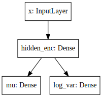

[Keras] is awesome. It is a very well-designed library that clearly abides by 
its [guiding principles] of modularity and extensibility, enabling us to 
easily assemble powerful, complex models from primitive building blocks. 
This has been demonstrated in numerous blog posts and tutorials, in particular,
the excellent tutorial on [Building Autoencoders in Keras]. 
As the name suggests, that tutorial provides examples of how to implement 
various kinds of autoencoders in Keras, including the variational autoencoder 
(VAE)[^kingma2014].

Like all autoencoders, the variational autoencoder is primarily used for 
unsupervised learning of hidden representations. 
However, they are fundamentally different to your usual neural network-based 
autoencoder in that they approach the problem from a probabilistic perspective. 
They specify a joint distribution over the observed and latent variables, and 
approximate the intractable posterior conditional density over latent 
variables with variational inference, using an *inference network* 
[^inference1] [^inference2] \(or more classically, a *recognition model* 
[^dayan1995]) to amortize the cost of inference.

While the examples in the aforementioned tutorial do well to showcase the 
versatility of Keras on a wide range of autoencoder model architectures, 
[its implementation of the variational autoencoder] doesn't properly take 
advantage of Keras' modular design, making it difficult to generalize and 
extend in important ways. As we will see, it relies on implementing custom 
layers and constructs that are restricted to a specific instance of 
variational autoencoders. This is a shame because when combined, Keras' 
building blocks are powerful enough to encapsulate most variants of the 
variational autoencoder and more generally, recognition-generative model 
combinations for which the generative model belongs to a large family of 
*deep latent Gaussian models* (DLGMs)[^rezende2014].

The goal of this post is to propose a clean and elegant alternative 
implementation that takes better advantage of Keras' modular design. 
It is not intended as tutorial on variational autoencoders [^1]. 
Rather, we study variational autoencoders as a special case of variational 
inference in deep latent Gaussian models using inference networks, and 
demonstrate how we can use Keras to implement them in a modular fashion such 
that they can be easily adapted to approximate inference in tasks beyond 
unsupervised learning, and with complicated (non-Gaussian) likelihoods.

This first post will lay the groundwork for a series of future posts that 
explore ways to extend this basic modular framework to implement the 
cutting-edge methods proposed in the latest research, such as the normalizing 
flows for building richer posterior approximations [^rezende2015], importance 
weighted autoencoders [^burda2015], the Gumbel-softmax trick for inference in 
discrete latent variables [^jang2016], and even the most recent GAN-based 
density-ratio estimation techniques for likelihood-free inference 
[^mescheder2017] [^tran2017].

# Model specification

First, it is important to understand that the variational autoencoder 
[is not a way to train generative models]. 
Rather, the generative model is a component of the variational autoencoder and
is, in general, a deep latent Gaussian model.
In particular, let $\mathbf{x}$ be a local observed variable and 
$\mathbf{z}$ its corresponding local latent variable, with joint 
distribution 

$$
p\_{\theta}(\mathbf{x}, \mathbf{z}) 
\= p\_{\theta}(\mathbf{x} | \mathbf{z}) p(\mathbf{z}).
$$

In Bayesian modelling, we assume the distribution of observed variables to be 
governed by the latent variables. Latent variables are drawn from a prior 
density $p(\mathbf{z})$ and related to the observations through the 
likelihood $p\_{\theta}(\mathbf{x} | \mathbf{z})$.
Deep latent Gaussian models (DLGMs) are a general class of models where the 
observed variable is governed by a *hierarchy* of latent variables, and the
latent variables at each level of the hierarchy are Gaussian *a priori* 
[^rezende2014].

In a typical instance of the variational autoencoder, we have only a single 
layer of latent variables with a Normal prior distribution,

$$
p(\mathbf{z}) = \mathcal{N}(\mathbf{0}, \mathbf{I}).
$$

Now, each local latent variable is related to its corresponding observation 
through the likelihood $p\_{\theta}(\mathbf{x} | \mathbf{z})$, which can 
be viewed as a *probabilistic* decoder. Given a hidden lower-dimensional 
representation (or "code") $\mathbf{z}$, it "decodes" it into a 
*distribution* over the observation $\mathbf{x}$.

## Decoder

In this example, we define $p\_{\theta}(\mathbf{x} | \mathbf{z})$ to be a 
multivariate Bernoulli whose probabilities are computed from $\mathbf{z}$ using 
a fully-connected neural network with a single hidden layer,

$$
\begin{align\*}
  p\_{\theta}(\mathbf{x} | \mathbf{z})
  & = \mathrm{Bern}( \sigma( \mathbf{W}\_2 \mathbf{h} + \mathbf{b}\_2 ) ), \newline
  \mathbf{h} 
  & = h(\mathbf{W}\_1 \mathbf{z} + \mathbf{b}\_1),
\end{align\*}
$$

where $\sigma$ is the logistic sigmoid function, $h$ is some non-linearity, and 
the model parameters 
$\theta = \\{ \mathbf{W}\_1, \mathbf{W}\_2, \mathbf{b}\_1, \mathbf{b}\_2 \\}$
consist of the weights and biases of this neural network.

It is straightforward to implement this in Keras with the 
[Sequential model API](https://keras.io/models/sequential/):
 
```python
decoder = Sequential([
    Dense(intermediate_dim, input_dim=latent_dim, activation='relu'),
    Dense(original_dim, activation='sigmoid')
])
```

You can view a summary of the model parameters $\theta$ by calling 
`decoder.summary()`. Additionally, you can produce a high-level diagram of 
the network architecture, and optionally the input and output shapes of each 
layer using [`plot_model`](https://keras.io/visualization/) from the 
`keras.utils.vis_utils` module. Although our architecture is about as 
simple as it gets, it is included in the figure below as an example of what
the diagrams look like.


Note that by fixing $\mathbf{W}\_1$, $\mathbf{b}\_1$ and $h$ to be the identity 
matrix, the zero vector, and the identity function, respectively (or 
equivalently dropping the first `Dense` layer in the snippet above 
altogether), we recover *logistic factor analysis*.
With similarly minor modifications, we can recover other members from the 
family of DLGMs, which include *non-linear factor analysis*, 
*non-linear Gaussian belief networks*, *sigmoid belief networks*, and many 
others [^rezende2014].

Having specified how the probabilities are computed, we can now define the 
negative log likelihood of a Bernoulli $- \log p\_{\theta}(\mathbf{x}|\mathbf{z})$, which is in fact equivalent to the [binary cross-entropy loss](https://en.wikipedia.org/wiki/Cross_entropy):

```python
def nll(y_true, y_pred):
    """ Negative log likelihood (Bernoulli). """

    # keras.losses.binary_crossentropy gives the mean
    # over the last axis. we require the sum
    return K.sum(K.binary_crossentropy(y_true, y_pred), axis=-1)
```

As we discuss later, this will not be the loss we ultimately minimize, but will
constitute the data-fitting term of our final loss.

Note this is a valid definition of a [Keras loss](https://keras.io/losses/), 
which is required to compile and optimize a model. It is a symbolic function 
that returns a scalar for each data-point in `y_true` and `y_pred`. 
In our example, `y_pred` will be the output of our `decoder` network, which
are the predicted probabilities, and `y_true` will be the true probabilities.

---

#### Side note: Using TensorFlow Distributions in loss

If you are using the TensorFlow backend, you can directly use the (negative) 
log probability of `Bernoulli` from TensorFlow Distributions as a Keras 
loss, as I demonstrate in my post on 
[Using negative log-likelihoods of TensorFlow Distributions as Keras losses](http://louistiao.me/posts/using-negative-log-likelihoods-of-tensorflow-distributions-as-keras-losses/).

Specifically we can define the loss as,

```python
def nll(y_true, y_pred):
    """ Negative log likelihood (Bernoulli). """

    lh = K.tf.distributions.Bernoulli(probs=y_pred)

    return - K.sum(lh.log_prob(y_true), axis=-1)
```
This is exactly equivalent to the previous definition, but does not call 
`K.binary_crossentropy` directly.

---

# Inference

Having specified the generative process, we would now like to perform inference
on the latent variables and model parameters $\mathbf{z}$ and $\theta$, 
respectively.
In particular, our goal is to compute the posterior 
$p\_{\theta}(\mathbf{z} | \mathbf{x})$, the conditional density of the latent 
variable $\mathbf{z}$ given observed variable $\mathbf{x}$.
Additionally, we wish to optimize the model parameters $\theta$ with respect to 
the marginal likelihood $p\_{\theta}(\mathbf{x})$. 
Both depend on the marginal likelihood, whose calculation requires marginalizing 
out the latent variables $\mathbf{z}$. In general, this is computational 
intractable, requiring exponential time to compute, or it is analytically 
intractable and cannot be evaluated in closed-form. In our case, we suffer from
the latter intractability, since our prior is Gaussian non-conjugate to the 
Bernoulli likelihood.

To circumvent this intractability we turn to *variational inference*, which 
formulates inference as an optimization problem. It seeks an approximate
posterior $q\_{\phi}(\mathbf{z} | \mathbf{x})$ closest in Kullback-Leibler 
(KL) divergence to the true posterior. More precisely, the approximate posterior 
is parameterized by *variational parameters* $\phi$, and we seek a setting
of these parameters that minimizes the aforementioned KL divergence,

$$
  \phi^\* = \mathrm{argmin}\_{\phi} 
  \mathrm{KL} [q\_{\phi}(\mathbf{z} | \mathbf{x}) || p\_{\theta}(\mathbf{z} | \mathbf{x}) ]
$$

With the luck we've had so far, it shouldn't come as a surprise anymore that 
*this too* is intractable. It also depends on the log marginal likelihood,
whose intractability is the reason we appealed to approximate inference in the 
first place. Instead, we *maximize* an alternative objective function, the 
*evidence lower bound* (ELBO), which is expressed as

$$
\begin{align\*}
  \mathrm{ELBO}(q) 
  & = 
  \mathbb{E}\_{q\_{\phi}(\mathbf{z} | \mathbf{x})} [
    \log p_{\theta}(\mathbf{x} | \mathbf{z}) + 
    \log p(\mathbf{z}) -
    \log q\_{\phi}(\mathbf{z} | \mathbf{x})
  ] \newline
  & = 
  \mathbb{E}\_{q\_{\phi}(\mathbf{z} | \mathbf{x})} 
  \[ \log p\_{\theta}(\mathbf{x} | \mathbf{z}) \]
  \- \mathrm{KL} \[ q\_{\phi}(\mathbf{z} | \mathbf{x}) || p(\mathbf{z}) \].
\end{align\*}
$$

Importantly, the ELBO is a lower bound to the log marginal likelihood. 
Therefore, maximizing it with respect to the model parameters $\theta$
approximately maximizes the log marginal likelihood. 
Additionally, maximizing it with respect to variational parameters $\phi$ can 
be shown to minimize
$\mathrm{KL} [q\_{\phi}(\mathbf{z} | \mathbf{x}) || p_{\theta}(\mathbf{z} | \mathbf{x}) ]$. 
Also, it turns out that the KL divergence determines the tightness of the lower 
bound, where we have equality iff the KL divergence is zero, which happens iff 
$q\_{\phi}(\mathbf{z} | \mathbf{x}) = p\_{\theta}(\mathbf{z} | \mathbf{x})$.
Hence, simultaneously maximizing it with respect to $\theta$ and $\phi$ gets us 
two birds with one stone.

Next we discuss the form of the approximate posterior 
$q\_{\phi}(\mathbf{z} | \mathbf{x})$, which can be viewed as a 
*probabilistic* encoder. Its role is opposite to that of the decoder. 
Given an observation $\mathbf{x}$, it "encodes" it into a *distribution* 
over its hidden lower-dimensional representations.

## Encoder

For each local observed variable $\mathbf{x}_n$, we wish to approximate 
the true posterior distribution $p(\mathbf{z}_n|\mathbf{x}_n)$ over its 
corresponding local latent variables $\mathbf{z}_n$. A common approach is to 
approximate it using a *variational distribution* 
$q\_{\lambda_n}(\mathbf{z}_n)$, specified as a diagonal 
Gaussian, where the *local* variational parameters 
$\lambda_n = \\{ \boldsymbol{\mu}_n, \boldsymbol{\sigma}_n \\}$ are the mean and 
standard deviation of this approximating distribution,
$$
  q\_{\lambda\_n}(\mathbf{z}\_n) = 
  \mathcal{N}(
    \mathbf{z}\_n | 
    \boldsymbol{\mu}\_n, 
    \mathrm{diag}(\boldsymbol{\sigma}\_n^2)
  ).
$$
This approach has a number of shortcomings. First, the number of local 
variational parameters we need to optimize grows with the size of the dataset. 
Second, a new set of local variational parameters need to be optimized for new 
unseen test points. This is not to mention the strong factorization assumption 
we make by specifying diagonal Gaussian distributions as the family of 
approximations. The last is still an active area of research, and the first 
two can be addressed by introducing a further approximation using an inference 
network.
### Inference network

We *amortize* the cost of inference by introducing an *inference network* which
approximates the local variational parameters $\lambda_n$ for a given local
observed variable $\textbf{x}_n$. 
For our approximating distribution in particular, given $\textbf{x}_n$ the 
inference network yields two vector-valued outputs $\boldsymbol{\mu}\_{\phi}(\textbf{x}_n)$ and 
$\boldsymbol{\sigma}\_{\phi}(\textbf{x}_n)$, which we use to approximate its local 
variational parameters $\boldsymbol{\mu}_n$ and $\boldsymbol{\sigma}_n$, respectively. 
Our approximate posterior distribution now becomes
$$
  q\_{\phi}(\mathbf{z}_n | \mathbf{x}_n) 
  \= 
  \mathcal{N}(\mathbf{z}_n 
  | \boldsymbol{\mu}\_{\phi}(\mathbf{x}_n), 
    \mathrm{diag}(\boldsymbol{\sigma}\_{\phi}^2(\mathbf{x}_n))
  ).
$$
Instead of learning *local* variational parameters $\lambda_n$ for each data-point, 
we now learn a fixed number of *global* variational parameters $\phi$ which 
constitute the parameters (i.e. weights) of the inference network. 
Moreover, this approximation allows statistical strength to be shared across 
observed data-points and also generalize to unseen test points.

We specify the mean $\boldsymbol{\mu}\_{\phi}(\mathbf{x})$ and log variance 
$\log \boldsymbol{\sigma}\_{\phi}^2(\mathbf{x})$ of this distribution as the output of 
an inference network. For this post, we keep the architecture of the network 
simple, with only a single hidden layer and two fully-connected output layers. 
Again, this is simple to define in Keras:

```python
# input layer
x = Input(shape=(original_dim,))

# hidden layer
h = Dense(intermediate_dim, activation='relu')(x)

# output layer for mean and log variance
z_mu = Dense(latent_dim)(h)
z_log_var = Dense(latent_dim)(h)
```

Since this network has multiple outputs, we couldn't use the Sequential model 
API as we did for the decoder. Instead, we will resort to the more powerful 
[Functional API](https://keras.io/getting-started/functional-api-guide/), 
which allows us to implement complex models with shared layers, multiple 
inputs, multiple outputs, and so on. 



Note that we output the log variance instead of the standard deviation because
this is not only more convenient to work with, but also helps with numerical 
stability. However, we still require the standard deviation later. To recover 
it, we simply implement the appropriate transformation and encapsulate it in a 
[Lambda layer](https://keras.io/layers/core/#lambda).

```python
# normalize log variance to std dev
z_sigma = Lambda(lambda t: K.exp(.5*t))(z_log_var)
```

Before moving on, we give a few words on nomenclature and context. 
In the prelude and title of this section, we characterized the approximate 
posterior distribution with an inference network as a probabilistic encoder 
(analogously to its counterpart, the probabilistic decoder). 
Although this is an accurate interpretation, it is a limited one. 
Classically, inference networks are known as *recognition models*, and have now
been used for decades in a wide variety of probabilistic methods.
When composed end-to-end, the recognition-generative model combination can be 
seen as having an autoencoder structure. Indeed, this structure contains the 
variational autoencoder as a special case, and also the now less fashionable
*Helmholtz machine* [^dayan1995]. 
Even more generally, this recognition-generative model combination constitutes 
a widely-applicable approach currently known as *amortized variational inference*, 
which can be used to perform approximate inference in models that lie beyond 
even the large class of deep latent Gaussian models.

Having specified all the ingredients necessary to carry out variational 
inference (namely, the prior, likelihood and approximate posterior), we next
focus on finalizing the definition of the (negative) ELBO as our loss function 
in Keras. As written earlier, the ELBO can be decomposed into two terms, 
$\mathbb{E}\_{q\_{\phi}(\mathbf{z} | \mathbf{x})} [ \log p\_{\theta}(\mathbf{x} | \mathbf{z}) ]$
the expected log likelihood (ELL) over $q\_{\phi}(\mathbf{z} | \mathbf{x})$,
and $- \mathrm{KL} [q\_{\phi}(\mathbf{z} | \mathbf{x}) || p(\mathbf{z}) ]$
the negative KL divergence between prior $p(\mathbf{z})$ and approximate 
posterior $q\_{\phi}(\mathbf{z} | \mathbf{x})$. We first turn our attention
to the KL divergence term.

### KL Divergence

Intuitively, maximizing the negative KL divergence term encourages approximate 
posterior densities that place its mass on configurations of the latent 
variables which are closest to the prior. Effectively, this regularizes the 
complexity of latent space. Now, since both the prior $p(\mathbf{z})$ and 
approximate posterior $q\_{\phi}(\mathbf{z} | \mathbf{x})$ are Gaussian, 
the KL divergence can actually be calculated with the closed-form expression,

$$
  \mathrm{KL} [ q\_{\phi}(\mathbf{z} | \mathbf{x}) || p(\mathbf{z}) ]
  = - \frac{1}{2} \sum_{k=1}^K \{ 1 + \log \sigma_k^2 - \mu_k^2 - \sigma_k^2 \}
$$

where $\mu_k$ and $\sigma_k$ are the $k$-th components of output vectors 
$\mu\_{\phi}(\mathbf{x})$ and $\sigma\_{\phi}(\mathbf{x})$, respectively.
This is not too difficult to derive, and I would recommend verifying this as an 
exercise. You can also find a derivation in the appendix of Kingma and Welling's 
(2014) paper [^kingma2014].

Recall that earlier, we defined the expected log likelihood term of the ELBO as
a Keras loss. We were able to do this since the log likelihood is a function of
the network's final output (the predicted probabilities), so it maps nicely to a 
Keras loss. Unfortunately, the same does not apply for the KL divergence term, 
which is a function of the network's intermediate layer outputs, the mean `mu`
and log variance `log_var`.

We define an auxiliary [custom Keras layer](https://keras.io/layers/writing-your-own-keras-layers/)
which takes `mu`  and `log_var` as input and simply returns them as output 
without modification. We do however explicitly introduce the 
[side-effect](https://en.wikipedia.org/wiki/Side_effect_(computer_science)) of 
calculating the KL divergence and adding it to a collection of losses, by 
calling the method `add_loss` [^2].

```python
class KLDivergenceLayer(Layer):

    """ Identity transform layer that adds KL divergence
    to the final model loss.
    """

    def __init__(self, *args, **kwargs):
        self.is_placeholder = True
        super(KLDivergenceLayer, self).__init__(*args, **kwargs)

    def call(self, inputs):

        mu, log_var = inputs

        kl_batch = - .5 * K.sum(1 + log_var -
                                K.square(mu) -
                                K.exp(log_var), axis=-1)

        self.add_loss(K.mean(kl_batch), inputs=inputs)

        return inputs
```

Next we feed `z_mu` and `z_log_var` through this layer (this needs to take 
place before feeding `z_log_var` through the Lambda layer to recover `z_sigma`).

```python
z_mu, z_log_var = KLDivergenceLayer()([z_mu, z_log_var])
```

Now when the Keras model is finally compiled, the collection of losses will be 
aggregated and added to the specified Keras loss function to form the loss we
ultimately minimize. If we specify the loss as the negative log-likelihood we 
defined earlier (`nll`), we recover the negative ELBO as the final loss we 
minimize, as intended.

---

#### Side note: Alternative divergences

A key benefit of encapsulating the divergence in an auxiliary layer is that we 
can easily implement and swap in other divergences, such as the 
$\chi$-divergence or the $\alpha$-divergence. 
Using alternative divergences for variational inference is an active research 
topic [^li2016] [^dieng2017].

---

#### Side note: Implicit models and adversarial learning

Additionally, we could also extend the divergence layer to use an auxiliary 
density ratio estimator function, instead of evaluating the KL divergence in 
the analytical form above. 
This relaxes the requirement on approximate posterior 
$q\_{\phi}(\mathbf{z}|\mathbf{x})$ (and incidentally also prior $p(\mathbf{z})$) 
to yield tractable densities, at the cost of maximizing a cruder estimate of the 
ELBO. 
This is known as Adversarial Variational Bayes[^mescheder2017], and is an 
important line of recent research that, when taken to its logcal conclusion, 
can extend the applicability of variational inference to arbitrarily expressive 
implicit probabilistic models with intractable likelihoods[^tran2017].

---

### Reparameterization using Merge Layers

To perform gradient-based optimization of ELBO with respect to model parameters 
$\theta$ and variational parameters $\phi$, we require its gradients with 
respect to these parameters, which is generally intractable. 
Currently, the dominant approach for circumventing this is by Monte Carlo (MC) 
estimation of the gradients. The basic idea is to write the gradient of the 
ELBO as an expectation of the gradient, approximate it with MC estimates, then 
perform stochastic gradient descent with the repeated MC gradient estimates.

There exist a number of estimators based on different variance reduction 
techniques. However, MC gradient estimates based on the reparameterization trick, 
known as the *reparameterization gradients*, have be shown to have the lowest 
variance among competing estimators for continuous latent variables[^rezende2014].
The reparameterization trick is a straightforward change of variables that 
expresses the random variable $\mathbf{z} \sim q\_{\phi}(\mathbf{z} | \mathbf{x})$
as a deterministic transformation $g\_{\phi}$ of another random variable 
$\boldsymbol{\epsilon}$ and input $\mathbf{x}$, with parameters $\phi$,

$$
z = g\_{\phi}(\mathbf{x}, \boldsymbol{\epsilon}), \quad 
    \boldsymbol{\epsilon} \sim p(\boldsymbol{\epsilon}).
$$

Note that $p(\boldsymbol{\epsilon})$ is simpler base distribution which is 
parameter-free and independent of $\mathbf{x}$ or $\phi$. 
To prevent clutter, we write the ELBO as an expectation of the function 
$f(\mathbf{x}, \mathbf{z}) = \log p\_{\theta}(\mathbf{x} , \mathbf{z}) - 
\log q\_{\phi}(\mathbf{z} | \mathbf{x})$ over distribution 
$q\_{\phi}(\mathbf{z} | \mathbf{x})$. 
Now, for any function $f(\mathbf{x}, \mathbf{z})$, taking the gradient of the 
expectation with respect to $\phi$, and substituting all occurrences of 
$\mathbf{z}$ with $g\_{\phi}(\mathbf{x}, \boldsymbol{\epsilon})$, we have

$$
\begin{align\*}
  \nabla\_{\phi} \mathbb{E}\_{q\_{\phi}(\mathbf{z} | \mathbf{x})}
  [ f(\mathbf{x}, \mathbf{z}) ]
  & = \nabla\_{\phi} \mathbb{E}\_{p(\boldsymbol{\epsilon})} 
  \[ f(\mathbf{x}, g\_{\phi}(\mathbf{x}, \boldsymbol{\epsilon})) \] \newline
  & = \mathbb{E}\_{p(\mathbf{\epsilon})} 
  \[ \nabla\_{\phi} f(\mathbf{x}, g\_{\phi}(\mathbf{x}, \boldsymbol{\epsilon})) \].
\end{align\*}
$$

In other words, this simple reparameterization allows the gradient and the 
expectation to commute, thereby allowing us to compute unbiased stochastic 
estimates of the ELBO gradients by drawing noise samples $\boldsymbol{\epsilon}$ 
from $p(\boldsymbol{\epsilon})$.

---

To recover the diagonal Gaussian approximation we specified earlier
$q\_{\phi}(\mathbf{z}_n | \mathbf{x}_n) = \mathcal{N}(\mathbf{z}_n | 
\boldsymbol{\mu}\_{\phi}(\mathbf{x}_n), \mathrm{diag}(\boldsymbol{\sigma}\_{\phi}^2(\mathbf{x}_n)))$, 
we draw noise from the Normal base distribution, and specify a simple 
location-scale transformation 


$$
\mathbf{z} 
= g\_{\phi}(\mathbf{x}, \boldsymbol{\epsilon}) 
= \mu\_{\phi}(\mathbf{x}) + 
  \sigma\_{\phi}(\mathbf{x}) \odot 
  \boldsymbol{\epsilon}, \quad
  \boldsymbol{\epsilon} 
\sim \mathcal{N}(\mathbf{0}, \mathbf{I}),
$$

where $\mu\_{\phi}(\mathbf{x})$ and $\sigma\_{\phi}(\mathbf{x})$ are the outputs 
of the inference network defined earlier with parameters $\phi$, and $\odot$ 
denotes the elementwise product. In Keras, we explicitly make the noise vector 
an input to the model by defining an Input layer for it. We then implement the 
above location-scale transformation using [Merge layers](https://keras.io/layers/merge/), namely `Add` and `Multiply`. 

```python
eps = Input(shape=(latent_dim,))

z_eps = Multiply()([z_sigma, eps])
z = Add()([z_mu, z_eps])
```


---

#### Side note: Monte Carlo sample size

Note both the inputs for observed variables and noise (`x` and `eps`) need to be 
specified explicitly as inputs to our final model. 
Furthermore, the size of their first dimension (i.e. batch size) are required 
to be the same. 
This corresponds to using a exactly one Monte Carlo sample to approximate the 
expected log likelihood, drawing a single sample $\mathbf{z}_n$ from 
$q\_{\phi}(\mathbf{z}_n | \mathbf{x}_n)$ for each data-point $\mathbf{x}_n$ in 
the batch. Although you might find an MC sample size of 1 surprisingly small, 
it is actually adequate for a sufficiently large batch size (~100) [^kingma2014].
In a [follow-up post](http://louistiao.me/posts/inference-in-variational-autoencoders-with-different-monte-carlo-sample-sizes/), 
I demonstrate how to extend our approach to support larger MC sample sizes using 
just a few minor tweaks. This extension is crucial for implementing the 
*importance weighted autoencoder* [^burda2015].

---

Now, since the noise input is drawn from the Normal distribution, we can save 
from having to feed in values for this input from outside the computation graph 
by binding a tensor to this Input layer. Specifically, we bind a tensor created 
using `K.random_normal` with the required shape,

```python
eps = Input(tensor=K.random_normal(shape=(K.shape(x)[0], latent_dim)))
```

While `eps` still needs to be explicitly specified as an input to compile the 
model, values for this input will no longer be expected by methods such as 
`fit`, `predict`. Instead, samples from this distribution will be lazily 
generated inside the computation graph when required. See my notes on 
[Keras Constant Input Layers with Fixed Source of Stochasticity](http://louistiao.me/notes/keras-constant-input-layers-with-fixed-source-of-stochasticity/) for more 
details.

---


---

In the [example implementation](https://github.com/keras-team/keras/blob/2.1.1/examples/variational_autoencoder.py), all of this logic is encapsulated in a single 
`Lambda` layer, which simultaneously draws samples from a hard-coded base 
distribution and also performs the location-scale transformation. 
In contrast, this approach achieves a good level of 
[loose coupling](https://en.wikipedia.org/wiki/Loose_coupling)
and [separation of concerns](https://en.wikipedia.org/wiki/Separation_of_concerns).
By decoupling the random noise vector from the layer's internal logic and 
explicitly making it a model input, we emphasize the fact that all sources of 
stochasticity emanate from this input. It thereby becomes clear that a random 
sample drawn from a particular approximating distribution is obtained by feeding 
this source of stochasticity through a number of successive deterministic 
transformations.

---

#### Side notes: Gumbel-softmax trick for discrete latent variables

As an example, we could provide samples drawn from the Uniform distribution 
as noise input. By applying a number of deterministic transformations that 
constitute the *Gumbel-softmax reparameterization trick* [^jang2016], we 
are able to obtain samples from the Categorical distribution. This allows us 
to perform approximate inference on *discrete* latent variables, and can be 
implemented in this framework by adding a dozen or so lines of code!

# Putting it all together

So far, we've dissected the variational autoencoder into modular components and 
discussed the role and implementation of each one at some length. 
Now let's compose these components together end-to-end to form the final 
autoencoder architecture.

```python
x = Input(shape=(original_dim,))
h = Dense(intermediate_dim, activation='relu')(x)

z_mu = Dense(latent_dim)(h)
z_log_var = Dense(latent_dim)(h)

z_mu, z_log_var = KLDivergenceLayer()([z_mu, z_log_var])
z_sigma = Lambda(lambda t: K.exp(.5*t))(z_log_var)

eps = Input(tensor=K.random_normal(shape=(K.shape(x)[0], latent_dim)))
z_eps = Multiply()([z_sigma, eps])
z = Add()([z_mu, z_eps])

decoder = Sequential([
    Dense(intermediate_dim, input_dim=latent_dim, activation='relu'),
    Dense(original_dim, activation='sigmoid')
])

x_pred = decoder(z)
```

It's surprisingly concise, taking up around 20 lines of code. 
The diagram of the full model architecture is visualized below.


Finally, we specify and compile the model, using the negative log likelihood 
`nll` defined earlier as the loss.

```python
vae = Model(inputs=[x, eps], outputs=x_pred)
vae.compile(optimizer='rmsprop', loss=nll)
```

# Model fitting

## Dataset: MNIST digits

```python
(x_train, y_train), (x_test, y_test) = mnist.load_data()
x_train = x_train.reshape(-1, original_dim) / 255.
x_test = x_test.reshape(-1, original_dim) / 255.   
```


```python
vae.fit(x_train,
        x_train,
        shuffle=True,
        epochs=epochs,
        batch_size=batch_size,
        validation_data=(x_test, x_test))
```

## Loss (NELBO) convergence

```python
pd.DataFrame(hist.history).plot(ax=ax) 
```


# Model evaluation

```python
encoder = Model(x, z_mu)

# display a 2D plot of the digit classes in the latent space
z_test = encoder.predict(x_test, batch_size=batch_size)
plt.figure(figsize=(6, 6))
plt.scatter(z_test[:, 0], z_test[:, 1], c=y_test,
            alpha=.4, s=3**2, cmap='viridis')
plt.colorbar()
plt.show()
```


```python
# display a 2D manifold of the digits
n = 15  # figure with 15x15 digits
digit_size = 28

# linearly spaced coordinates on the unit square were transformed
# through the inverse CDF (ppf) of the Gaussian to produce values
# of the latent variables z, since the prior of the latent space
# is Gaussian

z1 = norm.ppf(np.linspace(0.01, 0.99, n))
z2 = norm.ppf(np.linspace(0.01, 0.99, n))
z_grid = np.dstack(np.meshgrid(z1, z2))

x_pred_grid = decoder.predict(z_grid.reshape(n*n, latent_dim)) \
                     .reshape(n, n, digit_size, digit_size)

plt.figure(figsize=(10, 10))
plt.imshow(np.block(list(map(list, x_pred_grid))), cmap='gray')
plt.show()
```


# Recap

In this post, we covered the basics of amortized variational inference, looking
at variational autoencoders as a specific example. In particular, we

- Implemented the decoder and encoder using the
  [Sequential](https://keras.io/models/sequential/) and 
  [functional Model API](https://keras.io/models/model/) respectively.
- Augmented the final loss with the KL divergence term by writing an auxiliary 
  [custom layer](https://keras.io/layers/writing-your-own-keras-layers/).
- Worked with the log variance for numerical stability, and used a 
  [Lambda layer](https://keras.io/layers/core/#lambda) to transform it to the
  standard deviation when necessary.
- Explicitly made the noise an Input layer, and implemented the 
  reparameterization trick using [Merge layers](https://keras.io/layers/merge/).
- [Fixed the noise input to a stochastic tensor](http://louistiao.me/notes/keras-constant-input-layers-with-fixed-source-of-stochasticity/), 
  so random samples are generated *within* the computation graph.

# What's next

Next, we will extend the divergence layer to use an auxiliary density ratio 
estimator function, instead of evaluating the KL divergence in the analytical 
form above. 
This relaxes the requirement on approximate posterior 
$q\_{\phi}(\mathbf{z}|\mathbf{x})$ (and incidentally also prior $p(\mathbf{z})$) 
to yield tractable densities, at the cost of maximizing a cruder estimate of the 
ELBO. 
This is known as Adversarial Variational Bayes[^mescheder2017], and is an 
important line of recent research that, when taken to its logcal conclusion, 
can extend the applicability of variational inference to arbitrarily expressive 
implicit probabilistic models with intractable likelihoods[^tran2017].

---

Cite as:

```
@article{tiao2017vae,
  title   = "{A} {T}utorial on {V}ariational {A}utoencoders with a {C}oncise {K}eras {I}mplementation",
  author  = "Tiao, Louis C",
  journal = "tiao.io",
  year    = "2017",
  url     = "https://tiao.io/post/tutorial-on-variational-autoencoders-with-a-concise-keras-implementation/"
}
```

To receive updates on more posts like this, follow me on [Twitter] and [GitHub]!

[Twitter]: https://twitter.com/louistiao
[GitHub]: https://github.com/ltiao

## Links & Resources

Below, you can find:

* The [accompanying Jupyter Notebook](http://louistiao.me/listings/vae/variational_autoencoder.ipynb.html)
  used to generate the diagrams and plots in this post.
* The above snippets combined in a single executable Python file:

```python
import numpy as np
import matplotlib.pyplot as plt
from scipy.stats import norm

from keras import backend as K

from keras.layers import Input, Dense, Lambda, Layer, Add, Multiply
from keras.models import Model, Sequential
from keras.datasets import mnist


original_dim = 784
intermediate_dim = 256
latent_dim = 2
batch_size = 100
epochs = 50
epsilon_std = 1.0


def nll(y_true, y_pred):
    """ Negative log likelihood (Bernoulli). """

    # keras.losses.binary_crossentropy gives the mean
    # over the last axis. we require the sum
    return K.sum(K.binary_crossentropy(y_true, y_pred), axis=-1)


class KLDivergenceLayer(Layer):

    """ Identity transform layer that adds KL divergence
    to the final model loss.
    """

    def __init__(self, *args, **kwargs):
        self.is_placeholder = True
        super(KLDivergenceLayer, self).__init__(*args, **kwargs)

    def call(self, inputs):

        mu, log_var = inputs

        kl_batch = - .5 * K.sum(1 + log_var -
                                K.square(mu) -
                                K.exp(log_var), axis=-1)

        self.add_loss(K.mean(kl_batch), inputs=inputs)

        return inputs


decoder = Sequential([
    Dense(intermediate_dim, input_dim=latent_dim, activation='relu'),
    Dense(original_dim, activation='sigmoid')
])

x = Input(shape=(original_dim,))
h = Dense(intermediate_dim, activation='relu')(x)

z_mu = Dense(latent_dim)(h)
z_log_var = Dense(latent_dim)(h)

z_mu, z_log_var = KLDivergenceLayer()([z_mu, z_log_var])
z_sigma = Lambda(lambda t: K.exp(.5*t))(z_log_var)

eps = Input(tensor=K.random_normal(stddev=epsilon_std,
                                   shape=(K.shape(x)[0], latent_dim)))
z_eps = Multiply()([z_sigma, eps])
z = Add()([z_mu, z_eps])

x_pred = decoder(z)

vae = Model(inputs=[x, eps], outputs=x_pred)
vae.compile(optimizer='rmsprop', loss=nll)

# train the VAE on MNIST digits
(x_train, y_train), (x_test, y_test) = mnist.load_data()
x_train = x_train.reshape(-1, original_dim) / 255.
x_test = x_test.reshape(-1, original_dim) / 255.

vae.fit(x_train,
        x_train,
        shuffle=True,
        epochs=epochs,
        batch_size=batch_size,
        validation_data=(x_test, x_test))

encoder = Model(x, z_mu)

# display a 2D plot of the digit classes in the latent space
z_test = encoder.predict(x_test, batch_size=batch_size)
plt.figure(figsize=(6, 6))
plt.scatter(z_test[:, 0], z_test[:, 1], c=y_test,
            alpha=.4, s=3**2, cmap='viridis')
plt.colorbar()
plt.show()

# display a 2D manifold of the digits
n = 15  # figure with 15x15 digits
digit_size = 28

# linearly spaced coordinates on the unit square were transformed
# through the inverse CDF (ppf) of the Gaussian to produce values
# of the latent variables z, since the prior of the latent space
# is Gaussian
u_grid = np.dstack(np.meshgrid(np.linspace(0.05, 0.95, n),
                               np.linspace(0.05, 0.95, n)))
z_grid = norm.ppf(u_grid)
x_decoded = decoder.predict(z_grid.reshape(n*n, 2))
x_decoded = x_decoded.reshape(n, n, digit_size, digit_size)

plt.figure(figsize=(10, 10))
plt.imshow(np.block(list(map(list, x_decoded))), cmap='gray')
plt.show()
```

[^1]: For a complete treatment of variational autoencoders, and variational 
      inference in general, I highly recommend: 

      * Jaan Altosaar's blog post, [What is a variational autoencoder?](https://jaan.io/what-is-variational-autoencoder-vae-tutorial)
      * Diederik P. Kingma's PhD Thesis, 
      [Variational Inference and Deep Learning: A New Synthesis](https://www.dropbox.com/s/v6ua3d9yt44vgb3/cover_and_thesis.pdf?dl=1).

[^2]: To support sample weighting (fined-tuning how much each data-point 
      contributes to the loss), Keras losses are expected returns a scalar for each 
      data-point in the batch. In contrast, losses appended with the `add_loss`
      method don't support this, and are expected to be a single scalar. 
      Hence, we calculate the KL divergence for all data-points in the batch and 
      take the mean before passing it to `add_loss`.

[Keras]: https://keras.io/
[guiding principles]: https://keras.io/#guiding-principles
[Building Autoencoders in Keras]: https://blog.keras.io/building-autoencoders-in-keras.html
[its implementation of the variational autoencoder]: https://github.com/fchollet/keras/blob/2.1.1/examples/variational_autoencoder.py
[is not a way to train generative models]: http://dustintran.com/blog/variational-auto-encoders-do-not-train-complex-generative-models

[^kingma2014]: D. P. Kingma and M. Welling, "Auto-Encoding Variational Bayes," in Proceedings of the 2nd International Conference on Learning Representations (ICLR), 2014.
[^inference1]: [Edward tutorial on Inference Networks](http://edwardlib.org/tutorials/inference-networks)
[^inference2]: Section "Recognition models and amortised inference" in [Shakir's blog post](http://blog.shakirm.com/2015/01/variational-inference-tricks-of-the-trade/)
[^dayan1995]: Dayan, P., Hinton, G. E., Neal, R. M., & Zemel, R. S. (1995). The Helmholtz machine. Neural Computation, 7(5), 889–904. http://doi.org/10.1162/neco.1995.7.5.889
[^rezende2014]: Rezende, D. J., Mohamed, S., & Wierstra, D. (2014). "Stochastic backpropagation and approximate inference in deep generative models," in Proceedings of The 31st International Conference on Machine Learning, 2014, (Vol. 32, pp. 1278–1286). Bejing, China: PMLR. http://doi.org/10.1051/0004-6361/201527329
[^rezende2015]: D. Rezende and S. Mohamed, "Variational Inference with Normalizing Flows," in Proceedings of the 32nd International Conference on Machine Learning, 2015, vol. 37, pp. 1530–1538.
[^burda2015]: Y. Burda, R. Grosse, and R. Salakhutdinov, "Importance Weighted Autoencoders," in Proceedings of the 3rd International Conference on Learning Representations (ICLR), 2015.
[^jang2016]: E. Jang, S. Gu, and B. Poole, "Categorical Reparameterization with Gumbel-Softmax," Nov. 2016. in Proceedings of the 5th International Conference on Learning Representations (ICLR), 2017.
[^li2016]: Y. Li and R. E. Turner, "Rényi Divergence Variational Inference," in Advances in Neural Information Processing Systems 29, 2016.
[^dieng2017]: A. B. Dieng, D. Tran, R. Ranganath, J. Paisley, and D. Blei, "Variational Inference via chi Upper Bound Minimization," in Advances in Neural Information Processing Systems 30, 2017.
[^mescheder2017]: L. Mescheder, S. Nowozin, and A. Geiger, "Adversarial Variational Bayes: Unifying Variational Autoencoders and Generative Adversarial Networks," in Proceedings of the 34th International Conference on Machine Learning, 2017, vol. 70, pp. 2391–2400.
[^tran2017]: D. Tran, R. Ranganath, and D. Blei, "Hierarchical Implicit Models and Likelihood-Free Variational Inference," in Advances in Neural Information Processing Systems 30, 2017.
